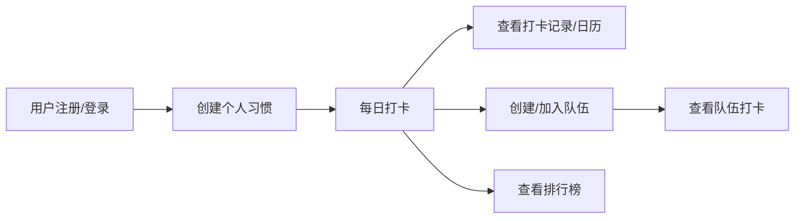

## 1. 产品概述
行为习惯打卡工具，帮助用户养成良好习惯，支持个人打卡和好友组队监督，通过排行榜激励用户坚持打卡，让习惯养成更有趣、更有动力。

## 2. 核心功能

### 2.1 用户角色
| 角色 | 注册方式 | 核心权限 |
|------|----------|----------|
| 普通用户 | 用户名/邮箱注册 | 创建习惯、打卡、组队、查看排行榜 |

### 2.2 功能模块
1. **登录注册页**：用户登录、注册、密码找回
2. **首页（打卡页）**：今日习惯列表、打卡操作、打卡日历
3. **习惯管理页**：创建、编辑、删除习惯
4. **队伍页**：创建队伍、加入队伍、队伍成员列表
5. **排行榜页**：个人排行、队伍排行
6. **个人中心页**：个人信息、我的习惯统计、设置

### 2.3 页面详情
| 页面名称 | 模块名称 | 功能描述 |
|---------|---------|----------|
| 登录注册页 | 登录模块 | 用户名/邮箱登录，表单验证，错误提示 |
| 登录注册页 | 注册模块 | 用户名/邮箱注册，密码确认，注册成功自动登录 |
| 首页 | 今日习惯 | 展示今日需要打卡的习惯列表，支持一键打卡 |
| 首页 | 打卡日历 | 展示本月打卡记录，可视化打卡情况 |
| 首页 | 连续打卡统计 | 展示当前连续打卡天数 |
| 习惯管理页 | 习惯列表 | 展示所有习惯，支持编辑、删除操作 |
| 习惯管理页 | 创建习惯 | 设置习惯名称、图标、颜色、目标频率 |
| 队伍页 | 队伍列表 | 展示已加入的队伍，可创建新队伍 |
| 队伍页 | 创建队伍 | 设置队伍名称、描述、邀请码 |
| 队伍页 | 加入队伍 | 通过邀请码加入队伍 |
| 队伍页 | 队伍详情 | 展示队伍成员、打卡情况 |
| 排行榜页 | 个人排行 | 按打卡天数排序，展示前100名用户 |
| 排行榜页 | 队伍排行 | 按队伍总打卡天数排序 |
| 个人中心页 | 个人信息 | 展示头像、用户名、总打卡天数 |
| 个人中心页 | 习惯统计 | 各习惯打卡统计图表 |

## 3. 核心流程
用户注册登录 → 创建个人习惯 → 每日打卡 → 可选择创建/加入队伍 → 查看排行榜

## 4. 用户界面设计

### 4.1 设计风格
- 主色调：渐变橙红色系（热情、活力），搭配清爽的蓝绿色作为辅助色
- 按钮风格：圆角卡片式按钮，带有微妙的阴影效果，点击有反馈动画
- 字体：现代无衬线字体，标题粗体，正文清晰易读
- 布局：卡片式布局，清晰的视觉层次
- 图标风格：线性图标，搭配emoji增加趣味性

### 4.2 页面设计概述
| 页面名称 | 模块名称 | UI元素 |
|---------|---------|--------|
| 登录注册页 | 登录/注册表单 | 渐变背景、浮动卡片表单、柔和阴影、输入框聚焦动画 |
| 首页 | 习惯卡片 | 彩色图标、打卡按钮动画、日历热力图 |
| 习惯管理页 | 习惯列表 | 彩色卡片、拖拽排序、滑动删除 |
| 队伍页 | 队伍卡片 | 队伍头像、成员列表、邀请码复制 |
| 排行榜页 | 排行列表 | 前三名特殊样式、奖牌图标、排名变化指示器 |
| 个人中心页 | 统计图表 | 环形进度图、柱状图、数据卡片 |

### 4.3 响应式
- 桌面端：侧边导航 + 主内容区
- 移动端：底部Tab导航，单列布局
- 触摸优化：大点击区域，滑动操作

## 5. 功能补充说明
- 打卡成功有庆祝动画（彩带效果
- 连续打卡里程碑奖励（徽章系统
- 分享功能支持生成打卡海报
- 夜间模式支持
