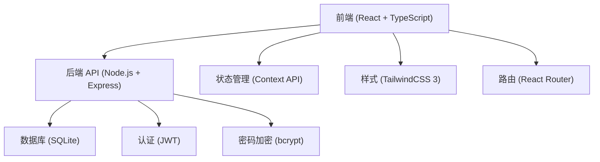
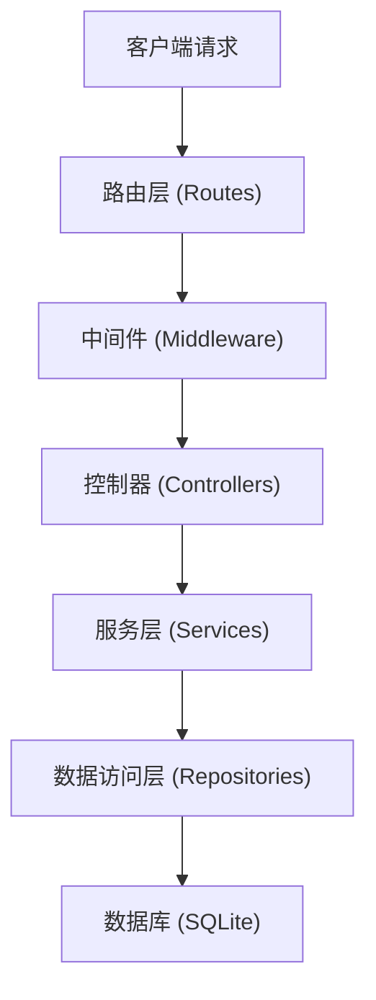
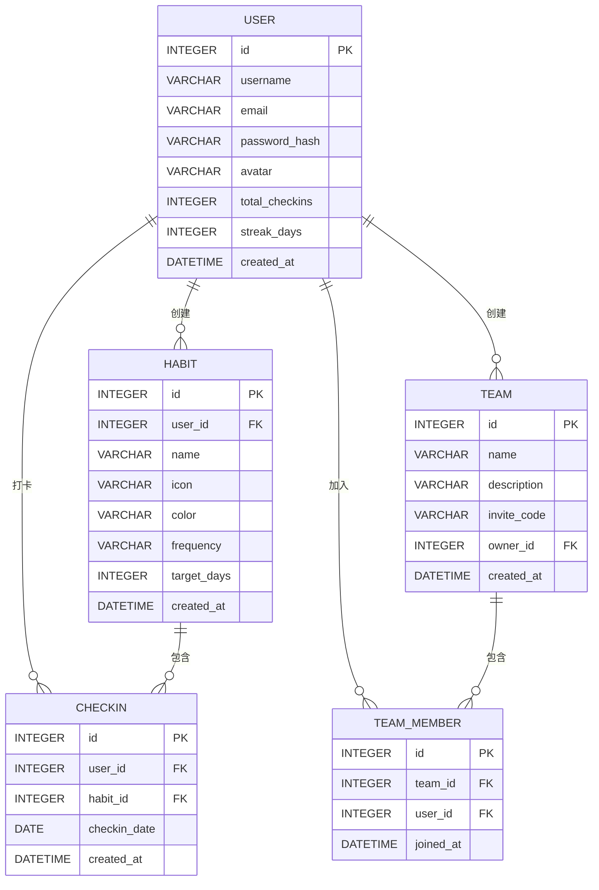

## 1. 架构设计



## 2. 技术描述
- **前端**：React 18 + TypeScript + Vite + TailwindCSS 3
- **初始化工具**：npm create vite@latest
- **后端**：Express 4 + TypeScript
- **数据库**：SQLite（使用 better-sqlite3）
- **认证**：JWT (jsonwebtoken)
- **密码加密**：bcryptjs
- **状态管理**：React Context API
- **路由**：React Router v6
- **HTTP客户端**：Axios
- **图表**：Recharts
- **图标**：Lucide React

## 3. 路由定义

| 前端路由 | 页面/组件 | 用途 |
|---------|----------|------|
| /login | LoginPage | 登录页面 |
| /register | RegisterPage | 注册页面 |
| / | HomePage | 首页（打卡页） |
| /habits | HabitsPage | 习惯管理页 |
| /teams | TeamsPage | 队伍列表页 |
| /teams/:id | TeamDetailPage | 队伍详情页 |
| /leaderboard | LeaderboardPage | 排行榜页 |
| /profile | ProfilePage | 个人中心页 |

| 后端API路由 | 方法 | 用途 |
|-----------|------|------|
| /api/auth/register | POST | 用户注册 |
| /api/auth/login | POST | 用户登录 |
| /api/auth/me | GET | 获取当前用户信息 |
| /api/habits | GET | 获取用户习惯列表 |
| /api/habits | POST | 创建习惯 |
| /api/habits/:id | PUT | 更新习惯 |
| /api/habits/:id | DELETE | 删除习惯 |
| /api/checkins | POST | 打卡 |
| /api/checkins/:date | GET | 获取指定日期打卡记录 |
| /api/checkins/history | GET | 获取打卡历史 |
| /api/teams | GET | 获取队伍列表 |
| /api/teams | POST | 创建队伍 |
| /api/teams/:id | GET | 获取队伍详情 |
| /api/teams/join | POST | 加入队伍 |
| /api/leaderboard/personal | GET | 个人排行榜 |
| /api/leaderboard/team | GET | 队伍排行榜 |
| /api/users/stats | GET | 获取用户统计数据 |

## 4. API 类型定义

```typescript
// 用户类型
interface User {
  id: number;
  username: string;
  email: string;
  avatar: string;
  totalCheckins: number;
  streakDays: number;
  createdAt: string;
}

// 习惯类型
interface Habit {
  id: number;
  userId: number;
  name: string;
  icon: string;
  color: string;
  frequency: 'daily' | 'weekly';
  targetDays: number;
  createdAt: string;
}

// 打卡记录类型
interface Checkin {
  id: number;
  userId: number;
  habitId: number;
  checkinDate: string;
  createdAt: string;
}

// 队伍类型
interface Team {
  id: number;
  name: string;
  description: string;
  inviteCode: string;
  ownerId: number;
  createdAt: string;
  memberCount: number;
}

// 队伍成员类型
interface TeamMember {
  id: number;
  teamId: number;
  userId: number;
  joinedAt: string;
  user: User;
}

// 排行榜类型
interface LeaderboardEntry {
  rank: number;
  userId: number;
  username: string;
  avatar: string;
  checkinCount: number;
}

// 认证请求
interface LoginRequest {
  username: string;
  password: string;
}

interface RegisterRequest {
  username: string;
  email: string;
  password: string;
  confirmPassword: string;
}

// 通用响应
interface ApiResponse<T> {
  success: boolean;
  data?: T;
  message?: string;
}
```

## 5. 服务器架构图



## 6. 数据模型

### 6.1 ER 图



### 6.2 DDL 语句

```sql
-- 用户表
CREATE TABLE IF NOT EXISTS users (
  id INTEGER PRIMARY KEY AUTOINCREMENT,
  username VARCHAR(50) UNIQUE NOT NULL,
  email VARCHAR(100) UNIQUE NOT NULL,
  password_hash VARCHAR(255) NOT NULL,
  avatar VARCHAR(255) DEFAULT '',
  total_checkins INTEGER DEFAULT 0,
  streak_days INTEGER DEFAULT 0,
  last_checkin_date DATE,
  created_at DATETIME DEFAULT CURRENT_TIMESTAMP
);

-- 习惯表
CREATE TABLE IF NOT EXISTS habits (
  id INTEGER PRIMARY KEY AUTOINCREMENT,
  user_id INTEGER NOT NULL,
  name VARCHAR(100) NOT NULL,
  icon VARCHAR(50) DEFAULT '✅',
  color VARCHAR(20) DEFAULT '#FF6B6B',
  frequency VARCHAR(10) DEFAULT 'daily',
  target_days INTEGER DEFAULT 7,
  created_at DATETIME DEFAULT CURRENT_TIMESTAMP,
  FOREIGN KEY (user_id) REFERENCES users(id) ON DELETE CASCADE
);

-- 打卡记录表
CREATE TABLE IF NOT EXISTS checkins (
  id INTEGER PRIMARY KEY AUTOINCREMENT,
  user_id INTEGER NOT NULL,
  habit_id INTEGER NOT NULL,
  checkin_date DATE NOT NULL,
  created_at DATETIME DEFAULT CURRENT_TIMESTAMP,
  FOREIGN KEY (user_id) REFERENCES users(id) ON DELETE CASCADE,
  FOREIGN KEY (habit_id) REFERENCES habits(id) ON DELETE CASCADE,
  UNIQUE(user_id, habit_id, checkin_date)
);

-- 队伍表
CREATE TABLE IF NOT EXISTS teams (
  id INTEGER PRIMARY KEY AUTOINCREMENT,
  name VARCHAR(100) NOT NULL,
  description TEXT,
  invite_code VARCHAR(20) UNIQUE NOT NULL,
  owner_id INTEGER NOT NULL,
  created_at DATETIME DEFAULT CURRENT_TIMESTAMP,
  FOREIGN KEY (owner_id) REFERENCES users(id) ON DELETE CASCADE
);

-- 队伍成员表
CREATE TABLE IF NOT EXISTS team_members (
  id INTEGER PRIMARY KEY AUTOINCREMENT,
  team_id INTEGER NOT NULL,
  user_id INTEGER NOT NULL,
  joined_at DATETIME DEFAULT CURRENT_TIMESTAMP,
  FOREIGN KEY (team_id) REFERENCES teams(id) ON DELETE CASCADE,
  FOREIGN KEY (user_id) REFERENCES users(id) ON DELETE CASCADE,
  UNIQUE(team_id, user_id)
);

-- 索引
CREATE INDEX IF NOT EXISTS idx_checkins_user_date ON checkins(user_id, checkin_date);
CREATE INDEX IF NOT EXISTS idx_checkins_habit ON checkins(habit_id);
CREATE INDEX IF NOT EXISTS idx_teams_invite_code ON teams(invite_code);
```
